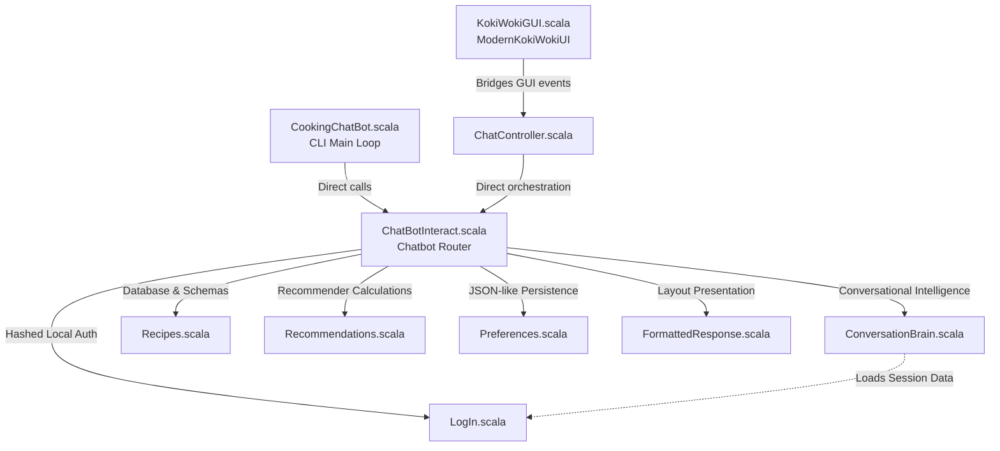

# 👨‍🍳 Koki Woki ChefBot

[](https://www.scala-lang.org/)
[](https://www.scala-sbt.org/)
[](https://github.com/scala/scala-swing)

Koki Woki ChefBot is an advanced, production-grade conversational AI recipe assistant and recommendation engine built entirely in **Scala**. Designed with rigorous software engineering principles, the application demonstrates high-level mastery of **functional programming paradigms**, **state-machine driven dialog flows**, and **explainable rule-based AI**.

The project delivers a dual-interface architecture: a premium, modern desktop **GUI** styled with custom glassmorphism and FlatLaf dark themes, and a highly responsive **CLI** console.

---

## 🚀 Advanced Core Engineering Features

The project is packed with highly complex, hard-worked features that showcase strong software design and functional architecture:

### 1. Explainable Recommendation Engine
* **Dynamic Preference Profiling**: Utilizes the user's structural preferences (favorite cuisines, difficulty styles, and dietary habits) to dynamically rank recommendations.
* **Explainable AI (XAI)**: Generates automated natural-language justifications explaining *why* a particular dish was recommended (e.g., *"Since you prefer Easy Italian dishes, I highly recommend making..."*), elevating user trust.

### 2. Multi-State Dialog Flow & Conversational State Machine
* **Encapsulated Flow Tracker**: Manages conversational branching via a structured `Option[String]` state machine. This allows the bot to guide users through complex, multi-step sub-dialogs (e.g., `quick_meal`, `comfort_food`, `healthy_food`) that dynamically branch based on follow-up inputs.
* **Step-by-Step Cooking Guide**: Tracks cooking session states (`cookingRecipe` and `cookingStep`) in real time. Guides the user through preparation instructions step-by-step, caching the session state and advancing only when the user types "done", wrapping up with an interactive completion celebration.

### 3. Ranked Multi-Attribute Semantic Search
* **Weighted Relevance Indexing**: Implements a custom term-weighting algorithm to calculate relevance scores on search terms (Recipe Name = 10 pts, Cuisine = 15 pts, Ingredient = 5 pts, Dietary Tag = 8 pts). Results are sorted in descending order of relevance.
* **Boolean Compound Search**: Parses query statements with `and` (e.g., "chicken and cheese"), performs separate weighted indexing queries, and computes strict list intersections to return perfect matches, with a clean union fallback.
* **Prep-Time Constraint Parsing**: Uses Regular Expressions to capture time constraints (e.g., *"under 20 minutes"* or *"max 30 mins"*), converts them to integer parameters, and filters the recipe knowledge base on matching criteria.

### 4. Positive & Negative Preference Constraint Modeling
* **Smart Sentiment Filters**: Analyzes user statements for negative modifiers (e.g., *"not"*, *"no"*, *"don't"*, *"never"*) to dynamically extract disfavored parameters and flag them under the user's `avoid` rules.
* **Proactive Exclusion Filtering**: Cross-references every search query and recommendation list against the user's `avoid` constraints. If a matching recipe contains an excluded parameter, it is proactively filtered out, and the chatbot displays an intelligent custom warning explaining the omission.

### 5. Conversation Analytics: Mood & Topic Modeling
* **Sentiment Dictionary Analysis**: Compiles user input history against positive and negative lexical dictionaries to calculate real-time emotional states, dynamically labeling the user's mood as *Positive*, *Frustrated*, or *Neutral*.
* **Aggregated Topic Extraction**: Analyzes active chat history records to construct frequency lists of discussed tags and cuisines, providing a summary breakdown of the user's culinary journey.

### 6. Event-Driven, Thread-Safe Desktop GUI
* **Modern Swing Styling**: Features custom-drawn, glassmorphism-inspired semi-transparent panels and FlatDarkLaf dark themes.
* **Asynchronous Scroll Rendering**: Leverages `SwingUtilities.invokeLater` to perform asynchronous UI calculations, ensuring the chat thread dynamically auto-scrolls to the bottom upon receiving new message bubbles without freezing the GUI.
* **Sidebar Dashboard**: Integrates fully responsive reactions for conversation summary popups, user preferences resets, and visual session log viewers.

---

## 🏛️ Project Modularity & Code Flow

Koki Woki ChefBot follows a strict modular architecture, maintaining high decoupling between the presentation layer, session controllers, and logical calculation engines:



---

## 📂 Source File Modularity & Mapping

| Filename | Directory Path | Architecture Layer | Core Responsibility |
| :--- | :--- | :--- | :--- |
| **`KokiWokiGUI.scala`** | `src/main/scala/KokiWokiGUI.scala` | Presentation Layer | Instantiates the desktop GUI application. Controls event-driven Swing reactions, modern glassmorphic rounded rendering, and UI thread safety. |
| **`CookingChatBot.scala`** | `src/main/scala/CookingChatBot.scala` | Presentation Layer | Hosts the interactive console application CLI, driving standard stream readers, validation, and session resuming. |
| **`ChatController.scala`** | `src/main/scala/ChatController.scala` | Controller Layer | Bridges UI events with database methods and handles state handoffs between the GUI and the engine. |
| **`ChatBotInteract.scala`** | `src/main/scala/ChatBotInteract.scala` | Routing Engine | The central `Chatbot` state router. Handles incoming command branching, matches greetings/conversation fallbacks, and tracks multi-step state flags. |
| **`ConversationBrain.scala`** | `src/main/scala/ConversationBrain.scala` | Calculation Engine | Implements natural language processing rules: smart semantic term weighting, regex extraction of prep-times, mood classifiers, and history search. |
| **`Recipes.scala`** | `src/main/scala/Recipes.scala` | Data Schema / DB | Defines the structural case classes (`Recipe` and `InteractionEntry`) and houses the core recipe dataset. |
| **`Recommendations.scala`** | `src/main/scala/Recommendations.scala` | Analytics Layer | Computes custom recommendation scores and constructs semantic explanation strings. |
| **`Preferences.scala`** | `src/main/scala/Preferences.scala` | Storage / DB | Serializes, loads, and manages key-value preference configurations (likes, dislikes, avoid parameters). |
| **`LogIn.scala`** | `src/main/scala/LogIn.scala` | Security / Auth | Authenticates user files, manages local passwords, and parses session history. |
| **`FormattedResponse.scala`** | `src/main/scala/FormattedResponse.scala` | Presentation Layer | Handles pretty-printing layouts, recipes, lists, and help menus. |

---

## 🛠️ Compilation & Application Launchers

### Prerequisites
* **Java SDK** (Version 11 or later, recommended Java 17).
* **SBT** (Scala Build Tool, version 1.9+).

### 🚀 Running the GUI (Desktop App)
To launch the highly responsive, modern Swing GUI version:
```bash
sbt "runMain chatBot.gui.ModernKokiWokiUI"
```

### 💻 Running the CLI (Console App)
To launch the interactive command line interface version:
```bash
sbt "runMain startChefBot"
```

---

## 🧩 Functional Programming (FP) Blueprints

The codebase acts as a stellar model for Functional Programming best practices in Scala:

| Paradigm | Code Application & Design |
| :--- | :--- |
| **Monadic Safeguards (`Option`)** | Eradicates runtime `NullPointerExceptions` by representing optional contexts (cuisine contexts, tag parameters, user preferences) in monadic `Option[A]` abstractions. |
| **Declarative Monadic Pipelines** | Heavily processes data using chains of higher-order monadic functions: `.map`, `.flatMap`, `.filter`, `.exists`, `.find`, and `.count` on immutable structures. |
| **Immutable Structures** | All core state trackers and lists are completely immutable, protecting internal state mutations and ensuring perfect UI thread safety. |
| **Pattern Matching** | Used comprehensively to destruct option types, route command syntax patterns, handle dialog flows, and safely parse user authentication branches. |
| **Case Classes** | Declares standard immutable schemas like `Recipe` and `InteractionEntry`, enabling out-of-the-box structural equality and compiler pattern matching support. |

---

## 💾 Local Storage Directory Layout

Session database persistence stores structured flat files inside the workspace under the `Users-data` directory:

```text
Users-data/
    hossam/
        Chat1.txt     # Complete session message logs (serialized)
        Chat2.txt     # Successive session log history
        prefs.txt     # Custom key-value preferences (cuisine:italian, avoid:spicy)
        summary.txt   # Short topic list of previous discussions
```

---

## 🚀 Future Roadmap
* **Relational DBMS**: Transitioning local storage database layout from raw text files to SQL-based structures like H2/PostgreSQL.
* **LLM Engine integration**: Upgrading search routines by pairing structural Scala functions with OpenAI/Gemini APIs.
* **Typo Tolerance**: Utilizing Levenshtein Distance for enhanced search autocomplete suggestions.
