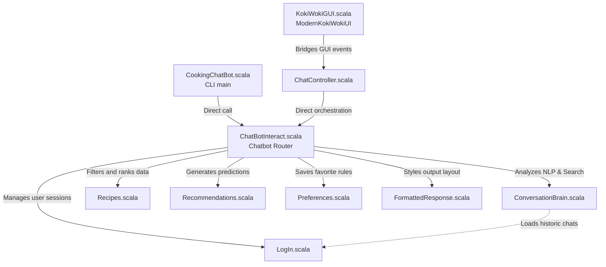

# 👨‍🍳 Koki Woki ChefBot

[](https://www.scala-lang.org/)
[](https://www.scala-sbt.org/)
[](https://github.com/scala/scala-swing)

Koki Woki ChefBot is a high-grade, modular **Scala** application that acts as your personalized AI Chef and Recipe Assistant. It combines state-of-the-art functional programming patterns, natural language parsing rules, a custom recommendation engine, and persistent session management into a seamless user experience.

The application features **both** a premium **Desktop GUI** built with Scala Swing & FlatLaf dark styling, and a robust **Command-Line Interface (CLI)**.

---

## 🌟 Core Features

### 1. Modern Desktop GUI (Glassmorphic Design)
* **Glassmorphism Panels**: Semi-transparent, sleek dark-themed UI built with professional FlatDarkLaf theme configurations.
* **Rounded Bubble Chats**: Distinct color bubbles for the user, bot, and recipe picks.
* **Auto-Scrolling Chat Panel**: Event-driven thread-safe UI updates for effortless message viewing.
* **Interactive Sidebar Navigation**: Quick access to conversation summaries, preference resetting, and session history logs.

### 2. Conversational Intent & Rule-Based NLP
* **Context Recognition**: Dynamically extracts cuisines, tags, ingredients, and preparation time constraints.
* **Advanced Greeting & Expression Matching**:
  * Recognizes varying greetings including slang like `helloz+` (e.g., `helloz`, `hellozz`, `hellozzzzz`).
  * Direct friendly response handling for custom expression patterns like `i love you` / `i love u` (with optional letter repetitions and punctuation).
* **Repeated Query Detection**: Identifies identical queries and gently prepends standard notifications to keep conversations clean.
* **Mood Analysis**: Automatically parses user interaction phrases to label user mood as positive, neutral, or frustrated.

### 3. Intelligent Recipe Search & Auto-complete
* **Multi-Attribute Ranking**: Weights terms dynamically (Name = 10 pts, Cuisine = 15 pts, Ingredient = 5 pts, Tag = 8 pts) to yield ranked search results.
* **Boolean Compound Search**: Evaluates phrases using `and` (e.g., "chicken and cheese") and computes list intersections.
* **Prefix Matching**: Provides autocomplete suggestions if no exact matches are found.
* **Prep Time Filters**: Decodes requests like "under 20 minutes" or "max 30 min" and filters matching recipes.

### 4. Custom Recommendation Engine
* **Taste Matching**: Computes tailored suggestions based on the user's saved favorite cuisine, dietary constraints, and difficulty preferences.
* **Dislike Avoidance**: Actively flags and filters out recipes containing tags or cuisines the user has explicitly requested to "avoid" or "not like".

### 5. Automated Data Persistence
* Sessions are structured and written locally in a secure file directory structure using `os-lib`.
* Users can pick up past chat sessions seamlessly from either the CLI list or the GUI combo selector.

---

## 🏛️ System Architecture

The following diagram illustrates the relationship and data flow between the core modules in Koki Woki ChefBot:



---

## 📂 Source File Breakdown

| Filename | Directory Path | Primary Responsibility |
| :--- | :--- | :--- |
| **`KokiWokiGUI.scala`** | `src/main/scala/KokiWokiGUI.scala` | Renders the premium Desktop GUI. Manages event-driven listeners, custom rounded panels, and scroll rendering. |
| **`CookingChatBot.scala`** | `src/main/scala/CookingChatBot.scala` | Command-line app launcher containing the main loop, command router, and StdIn readers. |
| **`ChatController.scala`** | `src/main/scala/ChatController.scala` | Intermediary controller bridging the GUI swing events with the core rule-based engines. |
| **`ChatBotInteract.scala`** | `src/main/scala/ChatBotInteract.scala` | Core router (`Chatbot` object). Orchestrates inputs, matches regex, routes greeting intents, and formats results. |
| **`ConversationBrain.scala`** | `src/main/scala/ConversationBrain.scala` | Semantic search, term ranking weights, time parsing, mood calculation, and compound phrase intersection. |
| **`Recipes.scala`** | `src/main/scala/Recipes.scala` | Contains the dataset schemas (`Recipe` and `InteractionEntry`) and full recipe database. |
| **`Recommendations.scala`** | `src/main/scala/Recommendations.scala` | Predicts tailored suggestions using dynamic similarity explanation. |
| **`Preferences.scala`** | `src/main/scala/Preferences.scala` | Persists user preferred cuisines, tags, and avoided items to local configuration files. |
| **`LogIn.scala`** | `src/main/scala/LogIn.scala` | Manages registration, hashed local password comparisons, and session catalog lists. |
| **`FormattedResponse.scala`** | `src/main/scala/FormattedResponse.scala` | Generates pretty-printed outputs, lists, and recipes. |

---

## 🛠️ Installation & How to Run

### Prerequisites
* **Java SDK** (Version 11 or later, recommended Java 17).
* **SBT** (Scala Build Tool, version 1.9+).

### 🚀 Running the GUI (Recommended)
Launch the beautifully styled Desktop application:
```bash
sbt "runMain chatBot.gui.ModernKokiWokiUI"
```

### 💻 Running the CLI Version
If you prefer to operate directly from the command line:
```bash
sbt "runMain startChefBot"
```

---

## 🧩 Functional Programming (FP) Concepts Applied

This project represents high-quality Scala architecture by leveraging clean functional paradigms:

| Concept | Implementation Details |
| :--- | :--- |
| **Immutable Collections** | All core lists (`List`, `Map`) are strictly immutable to prevent concurrent race conditions and ensure thread-safe UI updates. |
| **Pattern Matching** | Used heavily to safely process inputs, unpack `Option` values, match commands, and execute branch states. |
| **Higher-Order Functions** | Extensive use of monadic pipelines like `.map`, `.flatMap`, `.filter`, `.exists`, `.find`, and `.count` for concise operations. |
| **Case Classes** | Data models like `Recipe` and `InteractionEntry` are constructed as case classes, providing free structural equality, pattern matching support, and clean string outputs. |
| **Monads (`Option`)** | Safeguards the application from dreaded `NullPointerException` errors by modeling nullable fields (like cuisine context or avoiding criteria) in robust `Option[T]` monads. |

---

## 💾 Local Storage Directory Layout

Session database persistence stores information inside the workspace under the `Users-data` directory:

```text
Users-data/
    hossam/
        Chat1.txt     # Complete session message logs (serialized)
        Chat2.txt     # Successive session log history
        prefs.txt     # Custom key-value preferences (cuisine:italian, avoid:spicy)
        summary.txt   # Short topic list of previous discussions
```

---

## 🚀 Future Roadmap
* **H2 Database Integration**: Transitioning storage from raw flat text files to relational DBMS.
* **Natural Language API Integration**: Pairing the structural Scala search with OpenAI/Gemini APIs for generative chatting.
* **Typo Tolerance**: Utilizing Levenshtein Distance for enhanced autocomplete matching.
